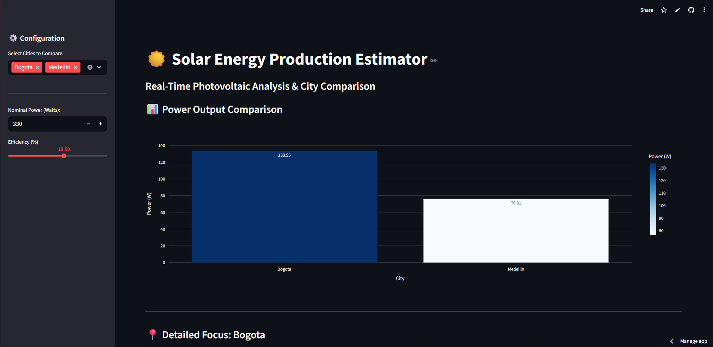

```markdown
# Solar Energy Prediction Estimator ☀️

A professional web application that calculates real-time photovoltaic energy output based on current weather conditions (temperature, humidity, and cloudiness) for any city in the world, with a special focus on Colombian capitals.

## 🚀 New Features
- **Multi-City Comparison:** Compare solar potential across multiple locations simultaneously using interactive charts.
- **External Data Management:** City lists are managed via an external `data/cities.json` file for better scalability.
- **Interactive Visualizations:** Built-in bar charts using Plotly for clear performance benchmarking.
- **Real-time Data:** Fetches live atmospheric data via OpenWeatherMap API.
- **Physics Engine:** Advanced calculations for irradiance and thermal derating factors based on local temperature.

## ⚙️ How it works
1. **Weather Fetching:** The app connects to OpenWeatherMap to get temperature, cloud coverage, and humidity.
2. **Irradiance Calculation:** Estimates available solar energy based on cloud density.
3. **Efficiency Loss:** Applies a thermal factor; solar panels lose efficiency as temperature rises.
4. **Final Output:** Provides the estimated Watts produced by your specific configuration.

## 📱 App Preview

*(Tip: Update these screenshots to show the new bar chart and the multi-select menu!)*

> **Try it yourself:** [🚀 Live Demo on Streamlit Cloud](https://solar-energy-prediction-nz8xf9vzthdfnysvwgcpqp.streamlit.app)

## 🛠️ Project Structure
```text
├── data/
│   └── cities.json          # External city database
├── src/
│   └── processing.py       # Physics & Math logic
├── .streamlit/
│   └── secrets.toml        # API Keys (Excluded from Git)
├── app.py                  # Main Streamlit UI
└── requirements.txt        # Project dependencies

```

## 💻 Installation & Setup

1. **Clone the repository:**
```bash
git clone [https://github.com/IvanBohorquez21/Solar-Energy-Prediction.git](https://github.com/IvanBohorquez21/Solar-Energy-Prediction.git)
cd Solar-Energy-Prediction

```


2. **Install dependencies:**
```bash
pip install -r requirements.txt

```


3. **Configure your Secrets:**
Create a `.streamlit/secrets.toml` file:
```toml
OPENWEATHER_API_KEY = "your_api_key_here"

```


4. **Run the application:**
```bash
streamlit run app.py

```


## 🛠️ Technologies Used

* **Python 3.x**
* **Streamlit** (Web Interface)
* **Plotly** (Interactive Graphics)
* **Pandas** (Data Management)
* **OpenWeatherMap API** (Environmental Data)

```