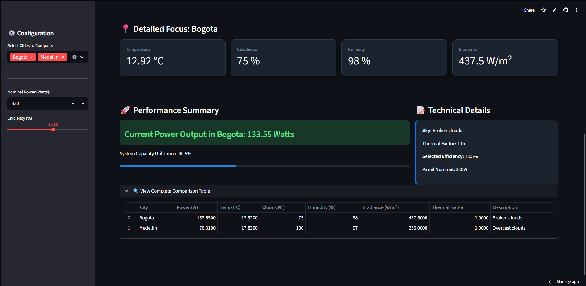
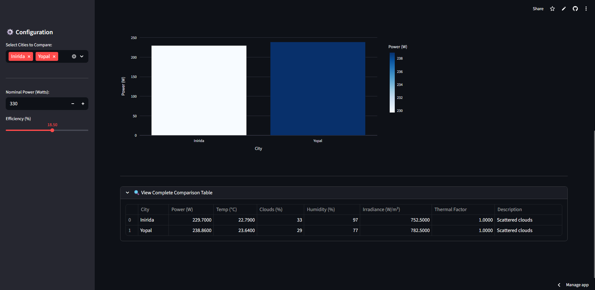

# Solar Energy Prediction Estimator ☀️

A professional web application that calculates real-time photovoltaic energy output based on current weather conditions (temperature and cloudiness) for any city in the world.

## ⚙️ How it works
- **Weather Data:** Fetches live data via OpenWeatherMap API.
- **Physics Engine:** Calculates irradiance and applies thermal derating factors.
- **Customizable:** Users can adjust panel nominal power and efficiency.

## 📱 App Preview



> **Try it yourself:** [🚀 Live Demo on Streamlit Cloud](https://solar-energy-prediction-nz8xf9vzthdfnysvwgcpqp.streamlit.app)


## 🚀 Features
- **Real-time Data:** Fetches current temperature and cloud cover for any city.
- **Technical Analysis:** Calculates irradiance and thermal derating factors.
- **Customizable:** Adjust panel nominal power and system efficiency via the UI.
- **Modular Architecture:** Clean separation between UI (Streamlit) and Logic (Python).

## 🛠️ Installation
1. Clone the repository:
   ```bash
   git clone [https://github.com/IvanBohorquez21/Solar-Energy-Prediction.git](https://github.com/IvanBohorquez21/Solar-Energy-Prediction.git)

    ```

2. Install dependencies:
    ```bash
        pip install -r requirements.txt

    ```


3. Create a `.streamlit/secrets.toml` file with your API Key:

    ```toml
        OPENWEATHER_API_KEY = "your_api_key_here"

    ```


4. Run the app:
    ```bash
        streamlit run app.py

    ```